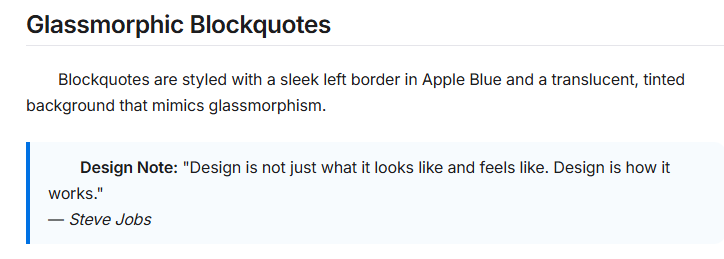
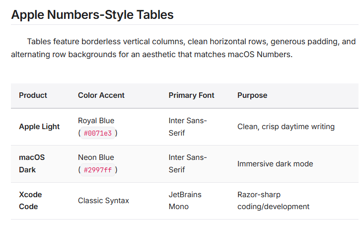

# Apple Elegant & Apple Stark Typora Themes 🍏

A premium collection of minimalist, typography-focused custom themes for **Typora** inspired by the sleek design of **Apple.com** and macOS. This repository offers two distinct stylistic variations to match your personal reading and writing preferences:

1. **Apple Elegant (Soft)**: Comfortable, warm-paper backgrounds (`#fafafa` in light mode, `#1c1c1e` in dark mode) to minimize eye strain during long writing sessions.
2. **Apple Stark (High Contrast)**: Pristine, high-contrast layouts featuring pure-white (`#ffffff`) and deep macOS-black (`#161617`) backgrounds for a bold and striking modern look.

Both themes feature native Light & Dark mode adaptation, custom macOS traffic lights for code blocks, circular checkboxes, elegant borderless tables, and polished sidebar styles.

### 🍏 Theme Features & Showcase

| 💻 macOS Terminal Code Blocks & Typography |
| :---: |
|  |
| *Figure 1: Clean typographic layout displaying custom macOS terminal-style code fences and a sharp sans-serif document layout.* |

| ✍️ Glassmorphic Blockquotes | 📊 Apple Numbers-Style Tables |
| :---: | :---: |
|  |  |
| *Figure 2: Sleek blockquotes with a left border in Apple Blue and translucent fill.* | *Figure 3: Minimalist, clean data sheets with soft horizontal dividers.* |

---

## 🚀 Quick Start Installation

Follow these steps to install and apply the themes:

### Step 1: Open Typora's Themes Folder
1. Launch **Typora**.
2. Open **Preferences**:
   - On **macOS**: Click `Typora` in the menu bar, then select `Preferences...` (or use shortcut `Cmd + ,`).
   - On **Windows/Linux**: Click `File` in the menu bar, then select `Preferences...` (or use shortcut `Ctrl + ,`).
3. Under the **Appearance** section, locate the **Themes** area and click the **Open Theme Folder** button.

### Step 2: Install the Theme CSS Files
1. Copy one or both of the theme `.css` files:
   - **`apple-elegant.css`**: Soft, warm-paper backgrounds.
   - **`apple-stark.css`**: High-contrast, pure-white/deep-black backgrounds.
2. Paste the chosen file(s) directly into the Typora Theme Folder that opened in **Step 1**.

### Step 3: Select and Enjoy!
1. **Restart Typora** so it can scan the new theme files.
2. In the Typora menu bar, go to **Themes** and select either **Apple Elegant** or **Apple Stark** (they will appear as separate options in the theme menu).
3. Experience your beautiful new workspace!

---

## 🎨 Design Highlights

* **Adaptive Dual-Tone Engine**: Built using modern CSS custom properties (`:root` variables) that automatically switch between Apple Light and macOS Dark modes using `@media (prefers-color-scheme)`.
* **Stunning Typography**: Loads Google Fonts **Inter** (to mimic SF Pro) and **JetBrains Mono** for razor-sharp, highly-legible code formatting.
* **Mac-Terminal Code Fences**: Fenced code blocks feature the iconic red, yellow, and green traffic lights in the top-left corner, set inside elegant rounded-corner containers with high-fidelity syntax styling.
* **Circular Task Icons**: Bulleted checklists are converted into clean macOS-native circular checkboxes that fill beautifully with Apple Blue when checked.
* **Numbers-Inspired Tables**: Borderless vertical columns, soft gray horizontal borders, and subtle alternating row tints with ample padding for clean data sheets.
* **Glassmorphic Blockquotes**: Soft primary borders with translucent accent fills to highlight critical thoughts without cluttering the canvas.
* **Subtle Transitions**: Fine-tuned micro-animations across hover states, selections, and button focus ranges for a responsive, living interface.
