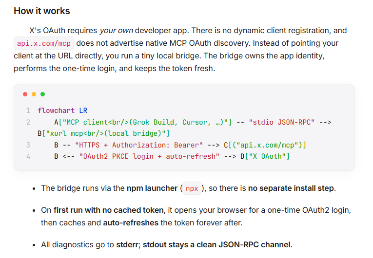

# Apple Elegant Typora Theme 🍏

A premium, minimalist, typography-focused custom theme for **Typora** inspired by the sleek design of **Apple.com** and macOS. It features native Light & Dark mode adaptation, custom macOS traffic lights for code blocks, circular checkboxes, elegant borderless tables, and polished sidebar styles.

*Above: A visual screenshot preview of the theme in action (this is a static image, not live installation steps).*

---

## 🚀 Quick Start Installation

Follow these steps to install and apply the **Apple Elegant** theme:

### Step 1: Open Typora's Themes Folder
1. Launch **Typora**.
2. Open **Preferences**:
   - On **macOS**: Click `Typora` in the menu bar, then select `Preferences...` (or use shortcut `Cmd + ,`).
   - On **Windows/Linux**: Click `File` in the menu bar, then select `Preferences...` (or use shortcut `Ctrl + ,`).
3. Under the **Appearance** section, locate the **Themes** area and click the **Open Theme Folder** button.

### Step 2: Install the Theme CSS File
1. Copy the file **`apple-elegant.css`** from this folder.
2. Paste it directly into the Typora Theme Folder that opened in **Step 1**.

### Step 3: Select and Enjoy!
1. **Restart Typora** so it can scan the new theme file.
2. In the Typora menu bar, go to **Themes** and select **Apple Elegant** (it will appear as "Apple Elegant" in the dropdown).
3. Experience your beautiful new workspace!

---

## 🎨 Design Highlights

* **Adaptive Dual-Tone Engine**: Built using modern CSS custom properties (`:root` variables) that automatically switch between Apple Light and macOS Dark modes using `@media (prefers-color-scheme)`.
* **Stunning Typography**: Loads Google Fonts **Inter** (to mimic SF Pro) and **JetBrains Mono** for razor-sharp, highly-legible code formatting.
* **Mac-Terminal Code Fences**: Fenced code blocks feature the iconic red, yellow, and green traffic lights in the top-left corner, set inside elegant rounded-corner containers with high-fidelity syntax styling.
* **Circular Task Icons**: Bulleted checklists are converted into clean macOS-native circular checkboxes that fill beautifully with Apple Blue when checked.
* **Numbers-Inspired Tables**: Borderless vertical columns, soft gray horizontal borders, and subtle alternating row tints with ample padding for clean data sheets.
* **Glassmorphic Blockquotes**: Soft primary borders with translucent accent fills to highlight critical thoughts without cluttering the canvas.
* **Subtle Transitions**: Fine-tuned micro-animations across hover states, selections, and button focus ranges for a responsive, living interface.
